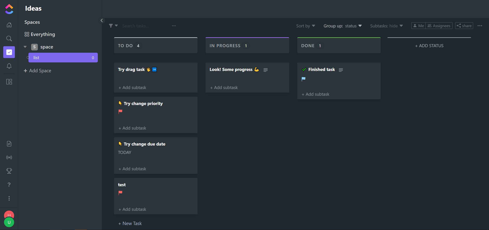

# ClickUp clone

Preview website: [ClickUp-Clone](http://1.12.70.249), or [click here](https://expo.dev/artifacts/eas/8cW8LMsz1NqVzAXDuPzvKk.apk) and download the android app `.apk` file directly

## Mobile app demo:

https://user-images.githubusercontent.com/88321505/236599844-fac465ce-261c-4c0c-af8c-9ce167aaa6d4.mp4

(Note: the temporary blackout in the demo video is due to the safe measure applied by andorid system automatically, in order to prevent user from recording password)

## Web app UI:

Login:


Main:



## Backend authorization workflow:

Implementation based on this [stackoverflow answer](https://stackoverflow.com/a/69631673/16648127), and this [tutorial](https://www.youtube.com/watch?v=25GS0MLT8JU) from Youtuber Ben Awad:

```
 +----------------+
 |                |
 |  React client  |
 |                |
 +----------------+
     ^    |    |
     |    |    |             +---------------+
     |    |    |  register   |               |                      +------------------------+
     |    |    |  login      |               |     # 1              |                        |
     |    |    +------------>|               |--------------------> | Authorization service  |
     |    |                  |               |                      |                        |
     |    |                  |               |                      +------------------------+
     |    |                  |               |                                   ^
     |    |  refresh token   |               |                                   |
     |    |                  |               |     # 2                           |
     |    +----------------->|    Gateway    |<----------------------------------+
     |                       |               |
     |                       |               |
     |   access resource     |               |                      +------------------------+
     |                       |               |     # 3              |                        |
     +---------------------->|               |<-------------------->|    Resource service    |
                             |               |                      |                        |
                             |               |                      +------------------------+
                             |               |
                             +---------------+
```

#### Step #1:

Authorization service authenticate the incoming register/login request, and issue an access token and a refresh token:

1. The access token stores `userId`, `subject`, `issuedAt`, and `expirationTime`. With the expiration time set to 30 min, the access token will be sent through response body, see `AuthorizationResponse` class;

2. The refresh token will store all of the claims(payload properties) like the access token, along with an extra one: `tokenVersion`. With the expiration time set to 7 days, the refresh token will be stored inside http session, so as to prevent client from accessing. The `tokenVersion` means to prevent the use of invalidated old token after user changes password.

#### Step #2:

Before access token expires, the client send a "refresh token" request, in order to get a new access token. The server will be checking the refresh `tokenVersion`. And then create a new access token and a new refresh token, and send back to client.

#### Step #3:

The client makes request to a protected resource server by presenting the access token. The resource server validates the access token, and if valid, serves the request.
